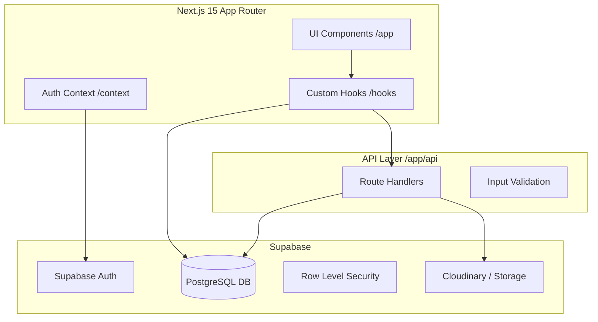

# وثيقة التسليم التقني - منصة مدرسة الرفعة الرقمية
## Technical Handover Documentation

هذه الوثيقة مخصصة للفريق البرمجي الجديد لاستلام المشروع وتشغيله وتطويره.

---

### 1. المعمارية التقنية (System Architecture)



*   **Frontend:** Next.js 15 (App Router), React 19, Tailwind CSS, Motion.
*   **Data Access:** 
    *   **Direct (Client):** يتم استخدام `supabase-js` مباشرة في الـ Hooks لعمليات الـ SELECT البسيطة.
    *   **Indirect (API):** يتم استخدام API Routes للعمليات التي تتطلب `Atomic Transactions` أو صلاحيات `Service Role`.
*   **Auth Flow:** يعتمد على `middleware.ts` للتحقق من الجلسة (Session) من جانب الخادم (SSR) وتوجيه المستخدم غير المسجل إلى صفحة `/login`.

---

### 2. هيكلية المشروع (Project Structure)

```text
/
├── app/                    # المسارات والصفحات والـ APIs
│   ├── (auth)/             # صفحات تسجيل الدخول وتغيير كلمة المرور
│   ├── api/                # نقاط نهاية الـ API (Route Handlers)
│   ├── dashboard/          # لوحات التحكم حسب الأدوار
│   ├── layout.tsx          # التخطيط الرئيسي ومزودي الخدمة (Providers)
│   └── middleware.ts       # حماية المسارات والتحقق من الهوية
├── components/             # المكونات الرسومية القابلة لإعادة الاستخدام
│   ├── ui/                 # مكونات الأساس (Shadcn/UI)
│   └── shared/             # مكونات منطق الأعمال المشتركة
├── context/                # سياق التطبيق (AuthContext)
├── hooks/                  # منطق الأعمال (Business Logic) - المحرك الرئيسي للنظام
├── lib/                    # المكتبات والإعدادات (supabase, cloudinary, utils)
├── types/                  # تعريفات TypeScript (Interfaces, Enums)
├── supabase/               # ملفات التهجير (Migrations) والبيانات الأولية (Seed)
└── public/                 # الملفات الثابتة والأيقونات
```

---

### 3. تدفق البيانات (Data Flow Examples)

#### أ. تسجيل الدخول (Login Flow):
1.  المستخدم يدخل الرقم المدني وكلمة المرور في `app/login/page.tsx`.
2.  يتم استدعاء `signIn` من `AuthContext`.
3.  الـ Context يبحث عن البريد الإلكتروني المرتبط بالرقم المدني في جداول (students/teachers/parents).
4.  يتم تنفيذ `supabase.auth.signInWithPassword`.
5.  الـ Middleware يكتشف الجلسة الجديدة ويسمح بالوصول.

#### ب. إنشاء واجب (Create Assignment):
1.  المعلم يستخدم `AssignmentForm`.
2.  يتم استدعاء `saveAssignment` من `useAssignmentsSystem`.
3.  يتم إرسال طلب `POST` إلى `/api/assignments/save`.
4.  الخادم ينفذ عملية إدراج متعددة (Assignment + Questions + Sections) في Transaction واحد.

---

### 4. توثيق الـ Hooks (Core Hooks)

| الـ Hook | المسؤولية | المخرجات الرئيسية |
| :--- | :--- | :--- |
| `useAuth` | إدارة الجلسة والصلاحيات | `user`, `userRole`, `signIn`, `signOut` |
| `useAssignmentsSystem` | إدارة الواجبات والدرجات | `data`, `saveAssignment`, `submitAssignment` |
| `useExamsSystem` | إدارة الاختبارات الإلكترونية | `exams`, `saveExam`, `submitExam` |
| `useMessagesSystem` | المراسلات الفورية والجماعية | `messages`, `sendMessage`, `markAsRead` |
| `useUsersSystem` | إدارة حسابات المستخدمين | `addStudent`, `updateTeacher`, `deleteUser` |

---

### 5. طبقة الـ API (Endpoints)

*   **Base URL:** `/api/`
*   **Security:** جميع الـ APIs تتطلب `Authorization Header` (JWT) ويتم التحقق منها عبر `createServerClient`.
*   **Endpoints الرئيسية:**
    *   `POST /api/assignments/save`: حفظ واجب جديد.
    *   `POST /api/attendance/save`: تسجيل الحضور.
    *   `POST /api/exams/save`: حفظ اختبار.
    *   `DELETE /api/users/delete`: حذف مستخدم نهائياً.

---

### 6. قاعدة البيانات والـ RLS

**الجداول الرئيسية:** `users`, `students`, `teachers`, `sections`, `exams`, `assignments`.

**أمثلة لسياسات RLS:**
*   **جدول `messages`:**
    ```sql
    CREATE POLICY "Users can view their own messages" 
    ON public.messages FOR SELECT 
    USING (auth.uid() = sender_id OR auth.uid() = receiver_id);
    ```
*   **جدول `exams`:**
    ```sql
    CREATE POLICY "Students view published exams" 
    ON public.exams FOR SELECT 
    USING (status = 'published');
    ```

---

### 7. نظام الصلاحيات (Permissions)

*   **Admin:** صلاحيات كاملة عبر الـ UI وتجاوز RLS في الـ API باستخدام `Service Role`.
*   **Teacher:** إدارة الطلاب والواجبات والاختبارات المرتبطة بفصوله فقط.
*   **Student:** الوصول إلى المواد الدراسية، حل الواجبات، ومشاهدة النتائج الخاصة به.
*   **Parent:** مشاهدة تقارير الأداء والحضور لأبنائه فقط.

---

### 8. الإعداد والتشغيل (Setup Guide)

1.  **المتطلبات:** Node.js 22+, Supabase Account, Cloudinary Account.
2.  **المتغيرات البيئية (`.env`):**
    ```env
    NEXT_PUBLIC_SUPABASE_URL=your_url
    NEXT_PUBLIC_SUPABASE_ANON_KEY=your_anon_key
    SUPABASE_SERVICE_ROLE_KEY=your_service_key
    NEXT_PUBLIC_CLOUDINARY_CLOUD_NAME=your_cloud_name
    NEXT_PUBLIC_CLOUDINARY_UPLOAD_PRESET=your_preset
    ```
3.  **التشغيل:**
    ```bash
    npm install
    npm run dev
    ```

---

### 9. ملاحظات الأداء والمشاكل المعروفة

*   **التحميل المتوازي:** يتم استخدام `Promise.all` في الـ Hooks لتقليل وقت جلب البيانات.
*   **إعادة التقديم (Re-rendering):** تم استخدام `useCallback` و `useMemo` بكثافة في الـ Hooks لضمان استقرار الواجهة.
*   **نقطة ضعف:** نظام الجداول الدراسية يعتمد على منطق معقد في الـ API للتحقق من التضارب، يجب الحذر عند تعديله.

---
**تم إعداد هذا التقرير ليكون المرجع الرسمي لعملية التسليم.**
